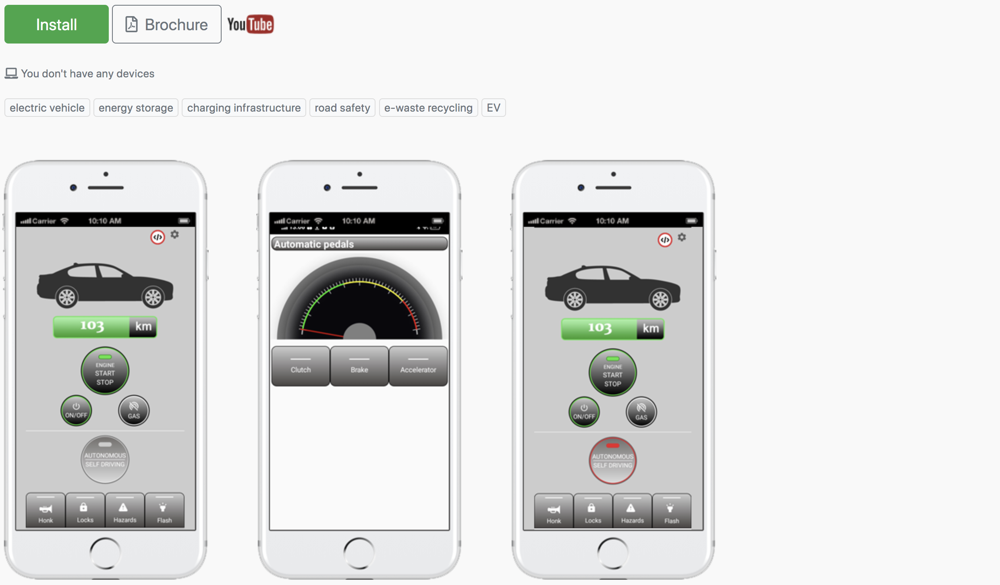

**OVH EV App**
===
OVH Electric Vehicle App that enables your car to steer, accelerate and brake automatically with full self-driving or autopilot or autonomous capability.

OVH Car Model eV-1 mobile app enables you to steer, accelerate and brake autonomously with full self-driving capabilities.

Spider Black's battery subsidiary, Lithium OVH Battery, forms an integral part of the OVH Electric Vehicle company particularly with its green energy storage and charging infrastructure division.
